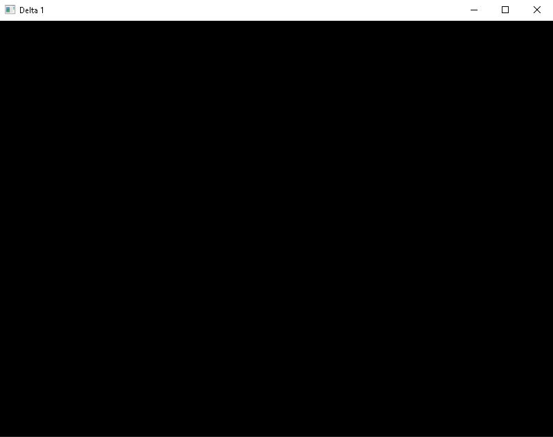
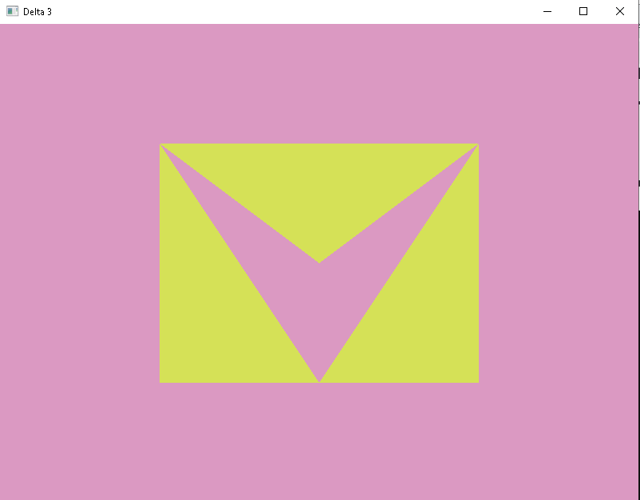
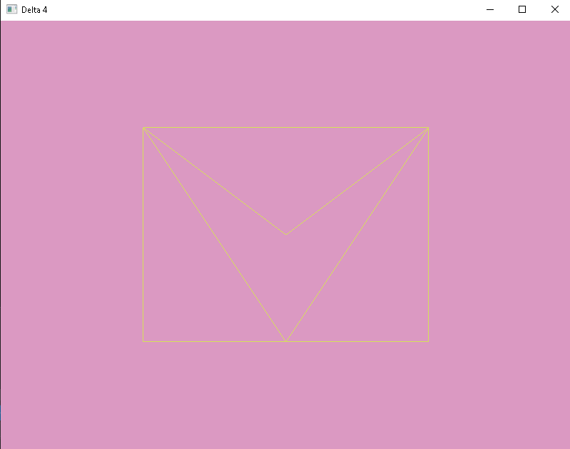
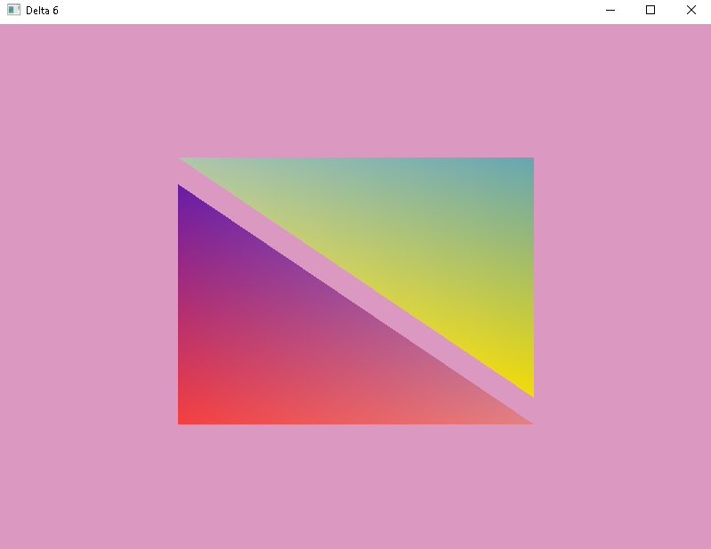
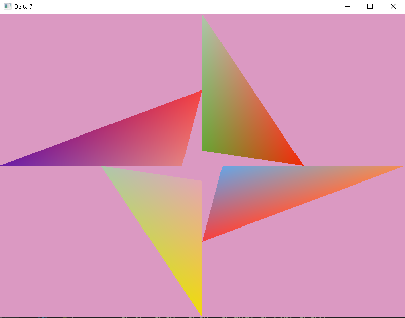
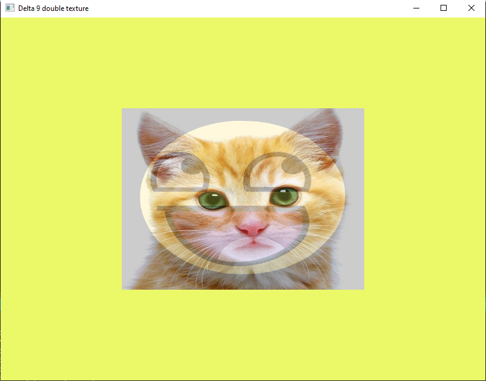
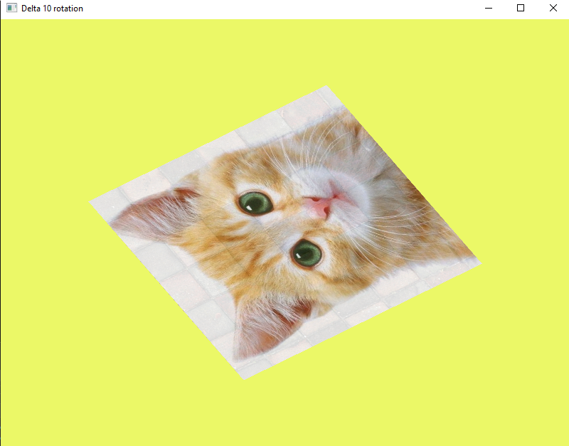
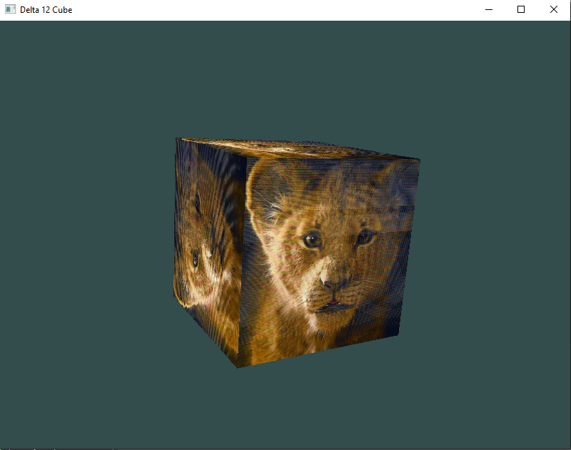
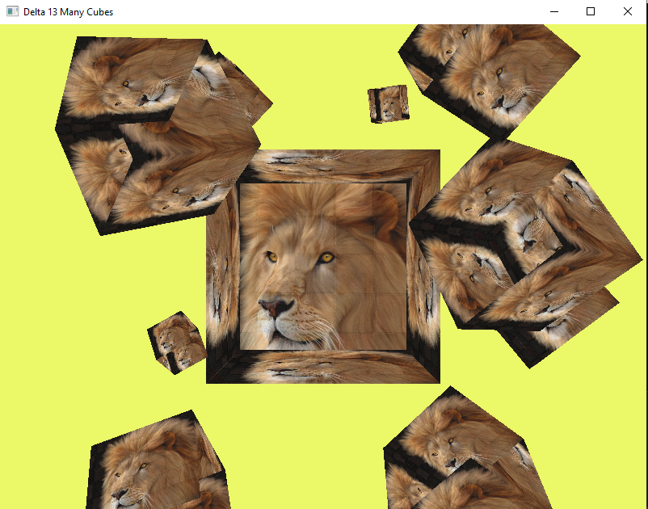

# CLOSED GOOD LUCK

# Requirements

> > IDE : Visual Studio 2019+

> > GLAD : Multi-Language GL/GLES/EGL/GLX/WGL Loader-Generator

> > GLFW : Graphics Library Framework

> > GLEW : Efficient run-time Loader

> > Programming Language : C++

> > Online book : https://learnopengl.com/

# Progress

> > > > > 

> > > > > 

> > > > > 

> > > > > 

> > > > > 

> > > > > 

> > > > > 

> > > > > 

> > > > > 

> > > > > 

> > > > > 

> > > > > 

> > > > > 

# Passage

> > > > > 

> > > > > 

> > > > > 

> > > > > 

> > > > > 

> > > > > 

> > > > > 

> > > > > 

> > > > > 

> > > > > 

> > > > > 

> > > > > 

> > > > > 

> > > > > 

> > > > > 

> > > > > 

> > > > > 

> > > > > 

> > > > > 

> > > > > 

> > > > > 

> > > > > 

> > > > > 
